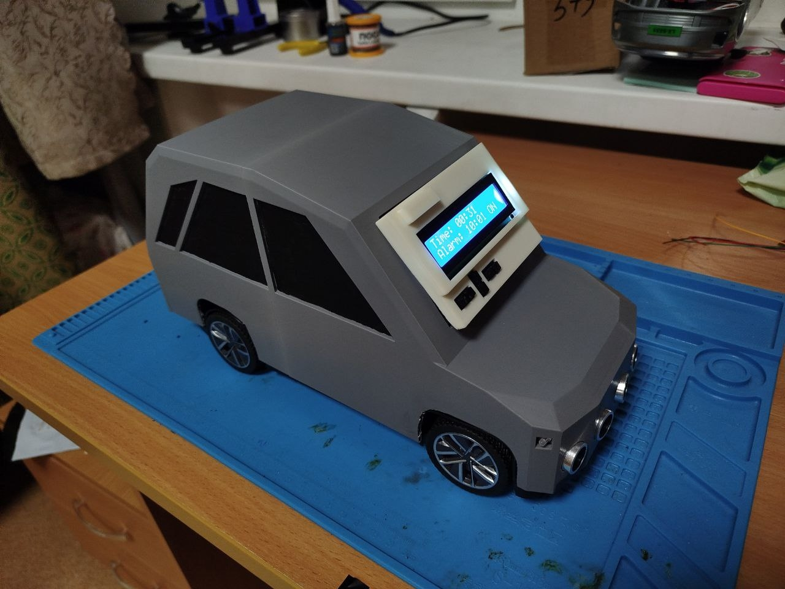
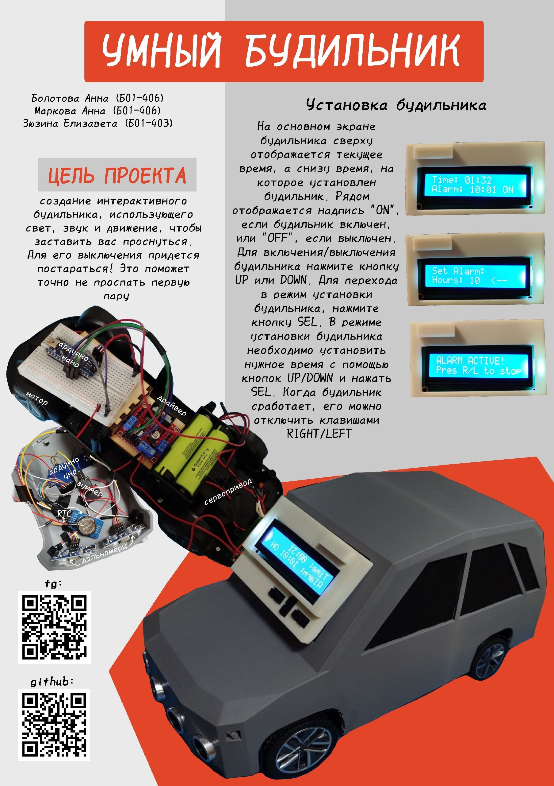

### Машинка-будильник

Этот проект создан для тех, кто не слышит будильники по утрам.

Этот будильник использует свет, шум и движения, чтобы заставить вас проснуться. Когда он срабатывает, машинка начинает хаотично ездить по комнате, издавая неприятные звуки и мигая фарами. Чтобы отключить такой будильник придется встать с кровати, поймать ее и нажать нужную кнопку

## Внешний вид устройства

## Установка будильника 

По умолчанию машинка отображает основной экран. На нем можно увидеть текущее время, время, на которое установлен будильник, и включен он или выключен. Для включения/выключения будильника нужно нажать кнопку UP/DOWN (неважно какую из них). Чтобы выбрать время срабатывания будильника, необходимо нажать кнопку SEL.

При нажатии кнопки SEL отображается экран установки будильника. В нем с помощию кнопок UP/DOWN можно установить нужное время. Далее нужно снова нажать SEL и вы вернетесь на основной эран.

Когда будильник сработает, на экране выведется сообщение, что будильник активен. Для отключения нужно нажать кнопку RIGHT/LEFT (неважно какую из них).

## Постер проекта

 